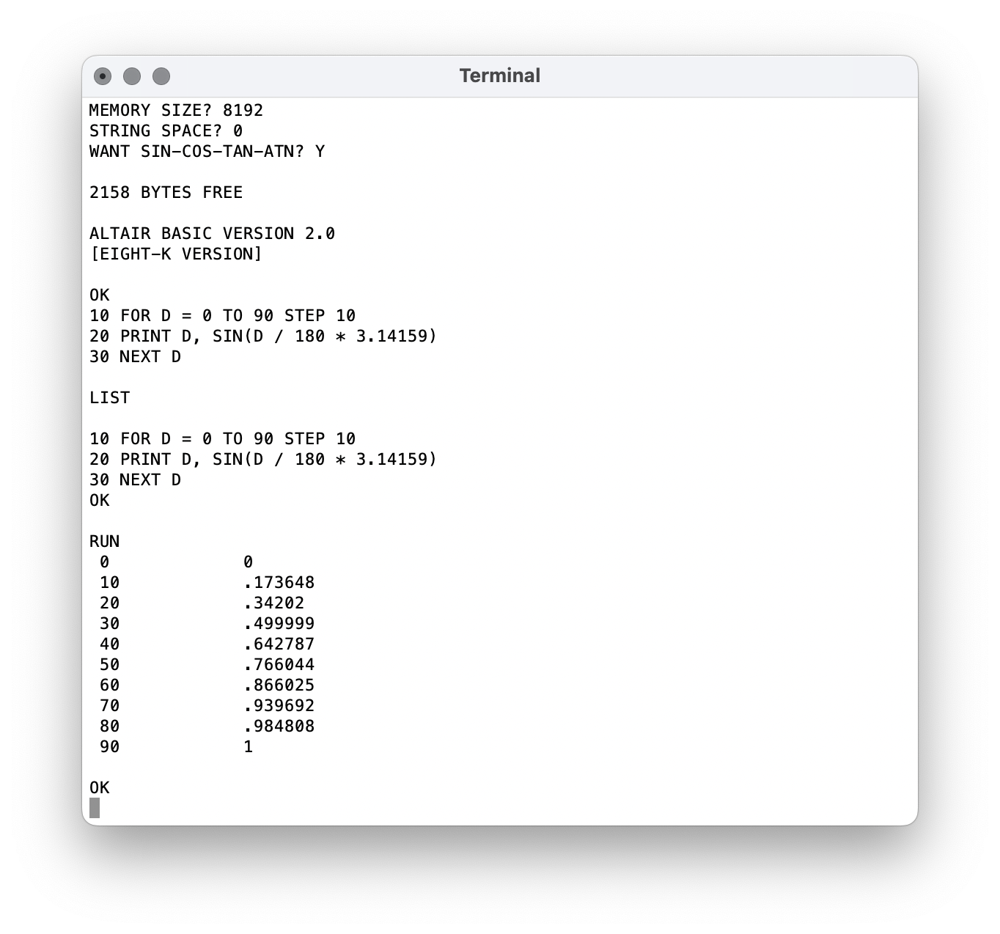

# Audiomoth Altair

A simulation of the Altair 8800 with 8KB RAM running Altair BASIC 2.0 on an AudioMoth device.

#### Usage ####

Clone the contents of [AudioMoth-Project](https://github.com/OpenAcousticDevices/AudioMoth-Project).

Copy the contents of the ```src``` and ```inc``` folders into the AudioMoth Project file structure and compile as described there.

The resulting ```audiomoth.bin``` file, or the pre-compiled ```AudioMoth-Altair-8800-1.0.0.bin```, can be written to any AudioMoth device using the [AudioMoth Flash App](https://www.openacousticdevices.info/applications).

Switch from USB/OFF to DEFAULT or CUSTOM to run the Altair 8800 simulator. Switching from DEFAULT to CUSTOM, or vice versa, at any time will reset the simulator.

The simulator appears a USB Serial device which can be connected to through any serial application, or from the command line:

```
> screen /dev/tty.usbmodem101
```

An example screenshot is shown below:


